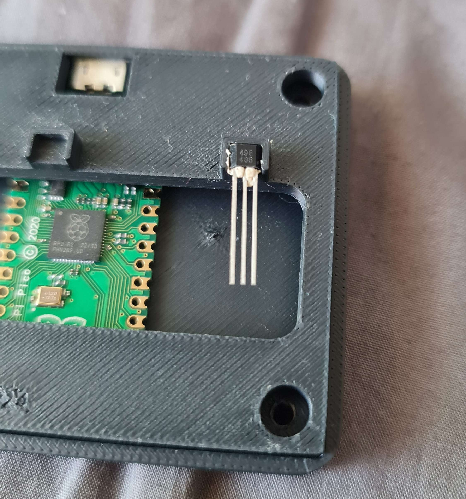
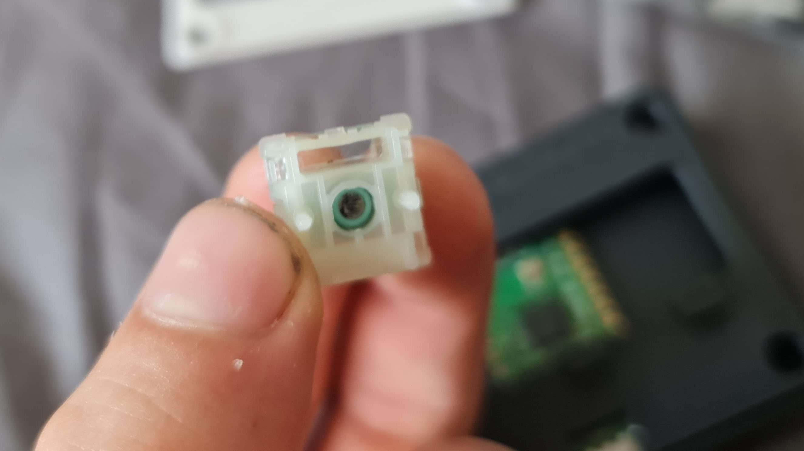

# Hall-effect Keypad using a Raspberry Pi Pico 1

RT-Pad is a 3 key keypad capable of using [rapid trigger](https://wooting.io/rapid-trigger) as the key input is from magnetic hall-effect sensors under a linear magnet switch.

## Hardware Used
- Raspberry pi pico 1
- 49E Hall Effect Sensor x3
- 3D printed case parts
- Self-tapping t10 screw x4
- Hall-effect key switch x3 (you can buy these or make yourself from normal linear switches)

## Software
The software is contained within a single INO file. To flash I used [Arduino IDE](https://www.arduino.cc/en/software/).
### Calibration
When creating the keypad, it is integral to calibrate the data to know the values read when each key is fully pressed/depressed. The calibration data are stored as constants in the source.

## Creation Gallery

